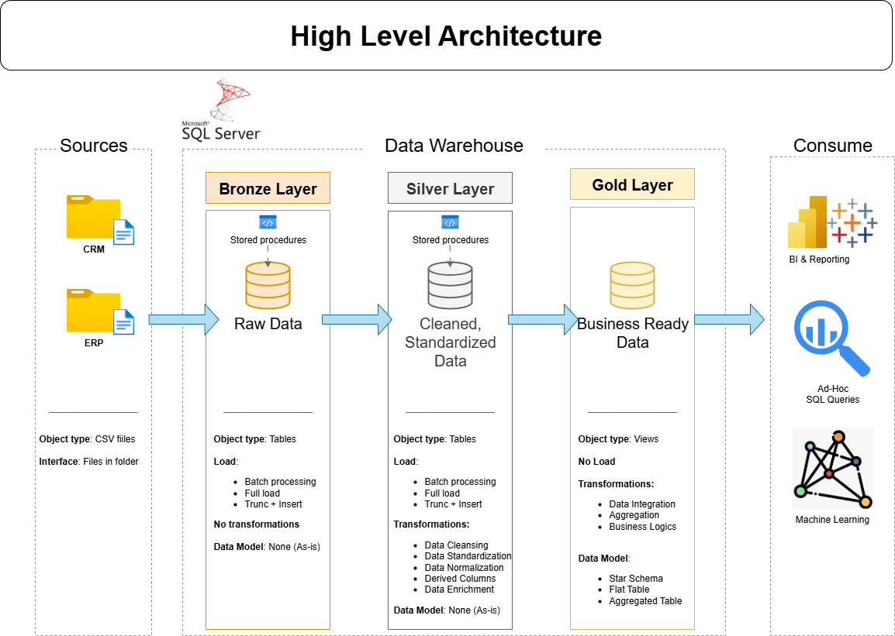

# Data Warehouse and Analytics Project

Welcome to the **Data Warehouse and Analytics Project** repository! 🚀      
This project is a follow-along project of the video [SQL Data Warehouse from Scratch | Full Hands-On Data Engineering Project](https://www.youtube.com/watch?v=9GVqKuTVANE).
It demonstrates a comprehensive data warehousing and analytics solution, from building data warehouse to generating actionable insights. Designed as a portfolio project, it highlights industry best practices in data engineering and analytics.

---
## 🏗️ Data Architecture
The data architecture for this project follows Medallion Architecture **Bronze**, **Silver**, and **Gold** layers:


1. **Bronze Layer**: Stores raw data as-is from the source system. Data is ingested from CSV Files into SQL Server Database.
2. **Silver Layer**: This layer includes data cleansing, standardization, and normalization process to prepare data for analysis.
3. **Gold Layer**: Houses business-ready data modeled into a star schema required for reporting and analytics.

---
## 📖 Project Overview

This project involves:

1. **Data Architecture**: Designing a modern data warehouse using medallion architecture **bronze**, **silver**, and **gold** layers.
2. **ETL Pipelines**: Extracting, transforming, and loading data from source systems into the warehouse.
3. **Data Modeling**: Developing fact and dimension tables optimised for analytical queries.
4. **Analytics & Reporting**: Creating SQL-based reports and dashboards for actionable insights.

🎯 This repository is an excellent resource for professionals and students looking to showcase expertise in:
- SQL Development
- Data Architect
- Data Engineering
- ETL Pipeline Developer
- Data Modeling
- Data Analytics

---

## 🛠️ Important Links and Tools:

Everything is for free!
- **[Datasets](datasets/):** Access to the project dataset (csv_files).
- **[SQL Server Express](https://www.microsoft.com/en-us/sql-server/sql-server-downloads):** Lightweight server for hosting your SQL database.
- **[SQL Server Management Studio (SSMS)](https://learn.microsoft.com/en-us/ssms/install/install?view=sql-server-ver16):** GUI for managing and interacting with databases.
- **[Git Repository](https://github.com/):** Set up a Github account and repository to manage, version and collaborate on your code efficiently.
- **[DrawIO](https://www.drawio.com/):** Design data architecture, models, flows, and diagrams.
- **[Notion](https://www.notion.com/):** All-in-one tool for project management and organization.
- **[Notion Project Steps](https://prickle-philosophy-032.notion.site/Data-Warehouse-Project-73a1c0841e4b4c0683889089b003c2f8?source=copy_link):** Access to all project phases and tasks.

---

## 🚀 Project Requirements

### Building the Data Warehouse (Data Engineering)

#### Objective
Develop a modern data warehouse using SQL Server to consolidate sales data, enabling analytical reporting and informed decison-making.

#### Specifications
- **Data Sources**: Import data from two source systems (CRM and ERP) provided as CSV files.
- **Data Quality**: Cleanse and resolve data quality issues prior to analysis.
- **Integration**: Combine both sources into a single, user-friendly data model designed for analytical queries.
- **Scope**: Focus on the latest dataset only; historization of data is not required.
- **Documentation**: Provide clear documentation of the data model to support both business stakeholders and analytics teams.

---

## 📂 Repository Structure
```
sql-data-warehouse-project-followalong/
├── LICENSE                                # License information for the repository
├── README.md                              # Project overview and instructions
├── datasets/                              # Raw datasets used for the project (CRM and ERP data)
|
├── docs/                                  # Project documentation and architecture details
│   ├── data_architecture.drawio           # Draw.io file shows the project's architecture
│   ├── data_architecture.png
│   ├── data_catalog.md                    # Catalog of datasets, including field descriptions and metadata
│   ├── data_flow.drawio                   # Draw.io file for the data flow diagram
│   ├── data_flow.png
│   ├── data_integration.drawio            # Draw.io file to show how tables are related
│   ├── data_integration.png
│   ├── data_model.drawio                  # Draw.io file for data models (star schema)
│   ├── data_model.png
│   ├── naming_conventions.md              # Consistent naming guidelines for tables, columns, and files
│   └── teaching-material-by-Baraa         # Some files the tutor drew using Procreate to ease teaching
│       ├── ETL.png                        # photo that shows all differnt techniques and methods of ETL
│       ├── Project_Notes_Sketches.pdf
│       └── data_layers.pdf
|
├── scripts/                               # SQL scripts for ETL and transformations
│   ├── bronze/                            # Scripts for extracting and loading raw data
│   ├── gold/                              # Scripts for creating analytical models
│   └── silver/                            # Scripts for cleaning and transforming data
│   ├── init_database.sql
|
└── tests/                                 # Test scripts and quality files
    ├── quality_checks_gold.sql
    └── quality_checks_silver.sql
```
---

## 🛡️ License

This project is licensed under the [MIT License](LICENSE). You are free to use, modify, and share this project with proper attribution.
